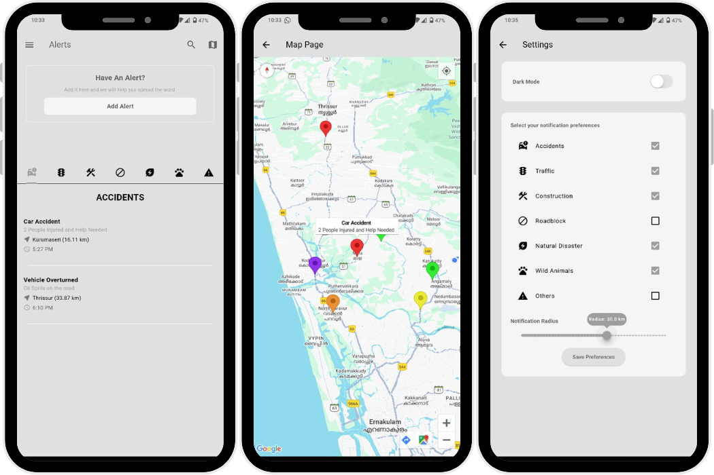
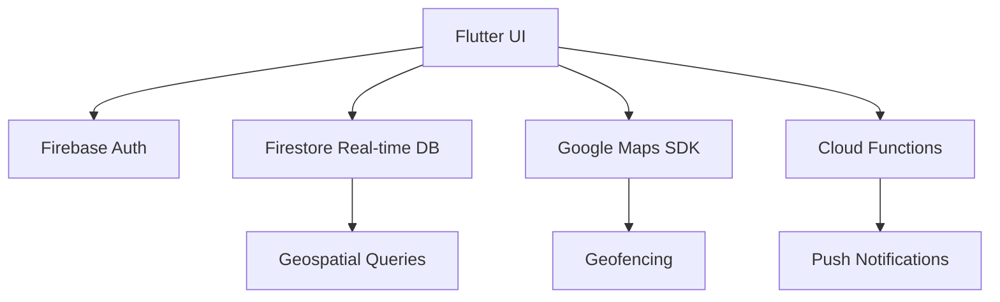

# 🚨 ResQ - Real-Time Disaster Alert App

A Flutter and Firebase-powered mobile application that enables real-time reporting and notification of community hazards, from accidents to natural disasters, creating safer neighborhoods through crowd-sourced alerts.

## 🌟 Key Features
<p align="center">
  
</p>

### 🚨 Real-Time Alert System
- **Multi-type alerts**: Report accidents, wildlife encounters, floods, roadblocks and more
- **Geotagged reports**: Precise location mapping for accurate alert distribution
- **Community verification**: Crowd-validated incident reports


### 🗺️ Interactive Hazard Map
- **Visual threat mapping**: Color-coded pins for different alert types
- **Proximity filtering**: See alerts within customizable radius (1-50km)
- **Real-time updates**: Live refresh of new community reports


### 🔔 Smart Notification System
- **Geofenced alerts**: Only receive relevant nearby notifications
- **Customizable preferences**: Select which alert types you want to receive
- **Urgency tiers**: Priority notification system for critical events


### ⚙️ User-Centric Design
- **Dark/Light mode**: Reduced eye strain for nighttime use
- **Accessibility**: High contrast UI for emergency situations


## 🛠️ Technical Architecture



## 🚀 Implementation Highlights

### Real-Time Alert Flow
1. User submits alert with location data
2. System verifies and geotags the report
3. Nearby users receive push notification
4. Alert appears on community map
5. Authorities can monitor developing situations

## 📱 UI/UX Features

- **Emergency-first design**: Critical functions accessible in 1 tap
- **Visual hierarchy**: Color-coded alert types for quick recognition
- **Minimal input**: Smart location detection reduces reporting time
- **Community validation**: Upvote/downvote system for report accuracy

## 🚨 Alert Types Supported

| Category          | Specific Alerts                     |
|-------------------|-------------------------------------|
| Transportation    | Accidents, Traffic, Roadblocks     |
| Wildlife          | Animal sightings, Encounters       |
| Natural Disasters | Floods, Landslides, Extreme Weather|
| Infrastructure    | Construction, Maintenance           |
| Community         | Suspicious activity, Missing persons|


## 🌍 Social Impact

- **Empowers citizens** to actively improve community safety
- **Reduces emergency response times** through crowd-sourced reporting
- **Creates historical data** for hazard prediction and prevention
- **Bridges communication gaps** between public and authorities

Each alert includes:

🔖 Category and Type

📍 Target Group or Location

🕒 Timestamped Delivery and Logging

🔔 Push Notifications to Mobile/Web Clients

📝 Audit Trail for Message Lifecycle (Sent, Edited, Deleted)


## 📅 Future Roadmap

- **AI verification**: Machine learning for automatic report validation
- **Authority integration**: Direct messaging with emergency services
- **Multimedia reports**: Photo/video evidence attachment
- **Predictive alerts**: Hazard forecasting based on historical data
- **Multi-language support**: Broader community accessibility

## 🛠️ Getting Started

### Prerequisites
- Flutter SDK (3.0+)
- Firebase project with enabled services

### Installation
```bash
git clone https://github.com/vishnuhari17/alert.git
cd alert
flutter pub get
flutterfire configure
flutter run --release
```

### 📲 Download & Try It Out

Want to experience ResQ in action?
You can download the latest APK and try it on your Android device:

<p align="center"> <a href="https://github.com/SandraMariyaGeorge/citizenAlertApp/releases/download/v3/app-release.apk">  </a> </p>
